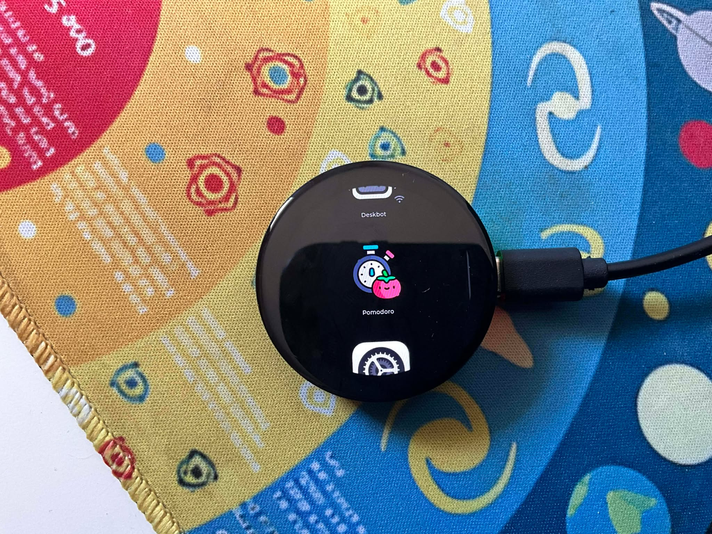
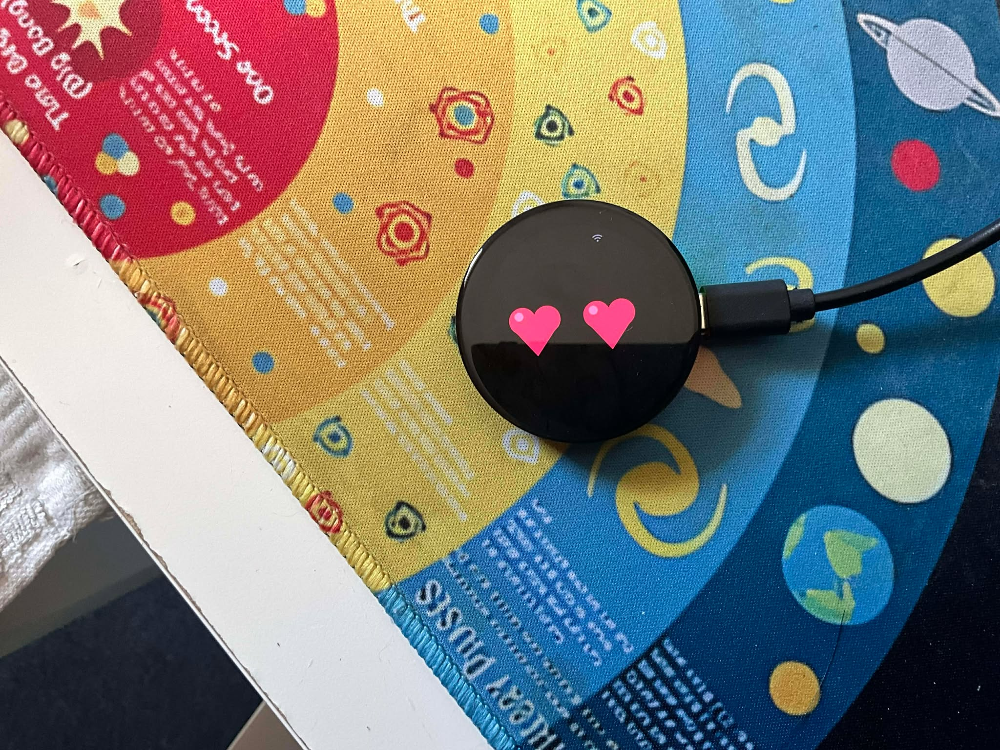
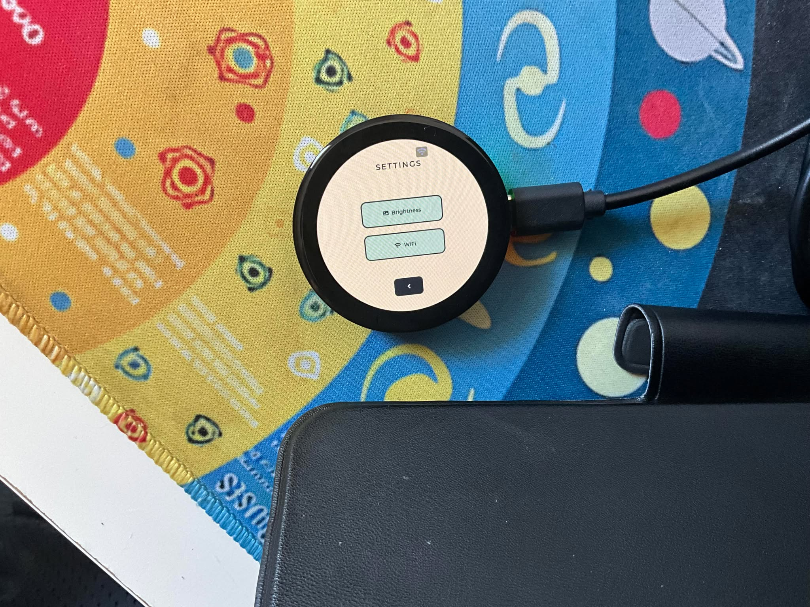

# 🤖 DeskBit - Desktop Companion Robot

<div align="center">



**DeskBit** คืออุปกรณ์ Desktop Companion ขนาดเล็กที่มาพร้อมหน้าจอ AMOLED กลม 1.43 นิ้ว
ออกแบบมาเพื่อเป็นเพื่อนคู่ใจบนโต๊ะทำงานของคุณ พร้อมฟีเจอร์สุดน่ารักและมีประโยชน์!

[](https://www.espressif.com/)
[](https://lvgl.io/)
[]()

### 🎬 Demo Video

[](https://www.youtube.com/watch?v=HIJs3vWXdCQ)

▶️ **[ดูวิดีโอ Demo บน YouTube](https://www.youtube.com/watch?v=HIJs3vWXdCQ)**

</div>

---

## ✨ คุณสมบัติหลัก (Main Features)

### 🎭 Robot Eyes - ดวงตาหุ่นยนต์สุดน่ารัก
<div align="center">



</div>

- **อารมณ์หลากหลาย**: แสดงอารมณ์ได้มากมาย เช่น Happy, Love, Angry, Sleep, Laugh และอื่นๆ
- **Animation ลื่นไหล**: ใช้ระบบ Physics-based animation ทำให้ดวงตาเคลื่อนไหวเหมือนมีชีวิต
- **Gaze System**: ดวงตาสามารถมองไปรอบๆ ได้อย่างเป็นธรรมชาติ
- **Blink Animation**: กระพริบตาอัตโนมัติแบบ Random
- **Love Mode**: ดวงตาเป็นรูปหัวใจสีชมพู 💕

---

### 🍅 Pomodoro Timer - ตัวจับเวลา Pomodoro

- **Session แบบปรับได้**: ตั้งเวลาทำงานได้ตั้งแต่ 1-60 นาที
- **Break แบบปรับได้**: ตั้งเวลาพักได้ตั้งแต่ 1-30 นาที
- **UI สวยงาม**: แสดง Progress Arc พร้อม Animation
- **บันทึกการตั้งค่า**: จดจำค่าที่ตั้งไว้แม้ปิดเครื่อง (NVS)

---

### ⚙️ Settings - หน้าจอตั้งค่า
<div align="center">



</div>

- **🔆 Brightness Control**: ปรับความสว่างหน้าจอได้ 0-100%
- **📶 WiFi Manager**: 
  - สแกนหา WiFi โดยรอบ
  - เชื่อมต่อ WiFi พร้อม Password Dialog
  - แสดงสถานะการเชื่อมต่อและ IP Address
  - บันทึก WiFi ที่เชื่อมต่อไว้
- **💾 NVS Storage**: บันทึกการตั้งค่าทั้งหมดลง Flash Memory

---

## 🛠️ Hardware Specification

| Component | Specification |
|-----------|---------------|
| **MCU** | ESP32-S3R8 (Dual-core LX7 @ 240MHz) |
| **Display** | 1.43" AMOLED, 466×466, 16.7M colors |
| **Touch** | Capacitive Touch (FT3168) |
| **RAM** | 512KB SRAM + 8MB PSRAM |
| **Flash** | 16MB |
| **IMU** | QMI8658 (6-axis Accelerometer/Gyroscope) |
| **RTC** | PCF85063 |
| **Connectivity** | WiFi 802.11 b/g/n + Bluetooth 5.0 |
| **Storage** | TF Card Slot |
| **Battery** | 3.7V Li-ion (MX1.25 connector) |
| **USB** | Type-C |

---

## 📁 Project Structure

```
deskbit/
├── main/                      # Main application entry
│   └── app_main.c            # Application main
├── components/               
│   ├── user_app/              # Main UI components
│   │   ├── ui_robo_eyes.c     # Robot eyes animation engine
│   │   ├── ui_settings.c      # Settings & Pomodoro UI
│   │   ├── ui_custom_anim.c   # Custom animation player
│   │   └── anim_manager.c     # Animation management system
│   ├── esp_wifi_bsp/          # WiFi driver
│   ├── touch_bsp/             # Touch driver
│   ├── pcf85063/              # RTC driver
│   ├── qmi8658c/              # IMU driver
│   └── lvgl/                  # LVGL graphics library
├── web_robot_face/            # Web-based Robot Face Studio
│   ├── index.html             # Web animation editor
│   ├── bridge_server.py       # ESP32 communication bridge
│   └── export_to_project.py   # Export animations to C code
└── readme/                    # Documentation images
```

---

## 🎨 Robot Eyes Expressions

DeskBit สามารถแสดงอารมณ์ได้หลากหลาย:

| Expression | Description |
|------------|-------------|
| 😊 **Happy** | ตาโค้งยิ้ม + แก้มแดง + ปากยิ้ม |
| 😍 **Love** | ดวงตาเป็นรูปหัวใจสีชมพู |
| 😠 **Angry** | คิ้วเฉียง + สั่นเล็กน้อย |
| 😴 **Sleep** | ตาปิด + ตัว Z ลอยขึ้น |
| 😂 **Laugh** | ตาหยี + ปากเปิดกว้าง + สั่นตัว |
| 😐 **Idle** | ดวงตาปกติ + กระพริบตาอัตโนมัติ |

---

## 🚀 Quick Start

### 1. Build & Flash

```bash
# Set up ESP-IDF environment
. $HOME/esp/esp-idf/export.sh

# Build the project
idf.py build

# Flash to device
idf.py -p COM3 flash monitor
```

### 2. Web Robot Face Studio

```bash
cd web_robot_face

# Start the editor
start index.html

# OR start with bridge server (for live preview on device)
python bridge_server.py
```

---

## 📱 Coming Soon

- 🔔 **Notification Support**: แจ้งเตือนจาก PC/Mobile
- 🗣️ **Voice Commands**: สั่งงานด้วยเสียง
- 📊 **Desktop Stats**: แสดงสถิติ CPU/RAM
- 🎮 **Mini Games**: เกมเล็กๆ เล่นผ่อนคลาย

---

## 📜 License

This project is for personal/educational use.

---

<div align="center">

### Made with ❤️ for Desktop Companions

**DeskBit** - Your Cute Desk Buddy! 🤖

</div>
